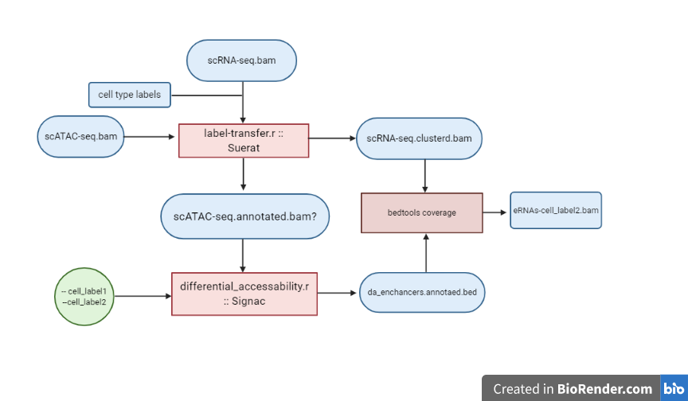

### **Goal: Detect differentially accesible enhancer RNAs in single-cell RNA seq data**
 
### Method: Develop pipeline that integrates scATAC-seq data with scRNA-seq data.

| 
| Main tool (bash): detect-sc-erna.sh
|     Inputs: cell-ranger bam files for scATAC-seq and scRNA-seq
|     outputs: Bam file of scRNAs detected in differentially accesible regions
| 
| 
| 
|  Script 1 (r): Cluster and Label scRNA-seq data
|     Inputs:
|     output:
| 
|  Script 2 (r): Transfer labels to scATAC-seq data
|     Inputs:
|     Output:
| 
|  Script 3 (r): Find genomic regions that are differentially accesible by comparing across cell type clusters
|     Inputs:
|     Output: bed file of DA genomic regions
| 
|  Script 4 (bash?): Use bed tools to find overlap of labeled scRNA seq data
|     Inputs: scRNA-seq.annotated.bam, da-enhances.bed
|     Outputs: sc-eRNA-seq.annotated.bam

